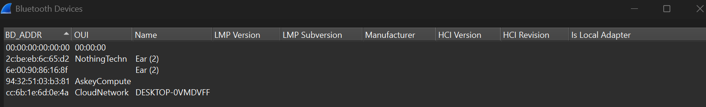

# Bluetooth For The Win

## Challenge Description

Mr Jaap Haartsen once told me that he used to have his secret mode of transmission through a technology he invented. There is a saying that he still have one message that no one could ever decrypt, I still have that file (bluetooth.pcap) and I challenge you to retrieve that message. PS: Mind that this guy used to FIDGET a lotttt!!!

## Approach

Alright so I saw that the file type of the attached file is `.pcap`. After Googling, I found  out that pcap files are basically `binary files that store network traffic data and are used to analyze network characteristics`.

Infact, PCAP stands for `Packet Capture`.

Now luckily, I had recently learnt about `Wireshark` in my Computer Network Protocols classes. Wireshark is a free packet analyser and I got a hunch that we might need to use it to solve this challenge.

Upon opening Wireshark I saw a lot of connections being made and packets being sent. After some Googling, I found that Jaap Haartsen was the inventor of Bluetooth, therefore our hint must lie in the `wireless` section.

Seems like there is a device called EAR2 whose OUI (organisation unique identifier) as `NothingTechnologies`. Well this quickly got me thinking about the Nothing Earbuds hinting that it must be something related to audio.

Then I went back to connections page and looked for connection to and from Nothing Technologies.

Interestingly, I found that wherever there was `AVRCP` protocol, there was some volume change going on.

.png)

Infact `AVRP stands for Audio/Video Remote Control Profile`.

So I filtered out all AVRCP protocols.

.png)

Now I was stuck for a pretty long time from here. Then I got the logic

`Volume UP - _`
`Volume DOWN - .`
`Pause/Play - (space)`

Umm so when I intially tried it(I made _ as .), I got a lame answer (JYTŹQED). Then I reversed it and got a sensible flag - `BLE_FTW`

From that I got this sequence : -... .-.. . ..--.- ..-. - .--

## Flag

`OCTF{BLE_FTW}`

