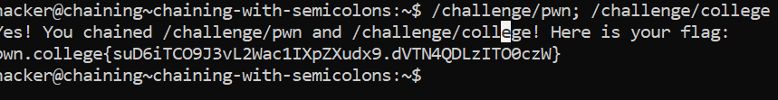

# Chaining With Semicolon

## Basic Understanding

We can chain multiple commands in Linux by using `;`.

## Challenge Objectives

The objectives of this challanege is to teach the user how to chain multiple commands.

## Challenge Goals

In this level, we must run `/challenge/pwn` and then `/challenge/college`, chaining them with a semicolon.

I chained the two commands by using the following command -

**Command** - `/challenge/pwn; /challenge/college`

From this,I got the flag.

## Flag

**pwn.college{suD6iTCO9J3vL2Wac1IXpZXudx9.dVTN4QDLzITO0czW}**