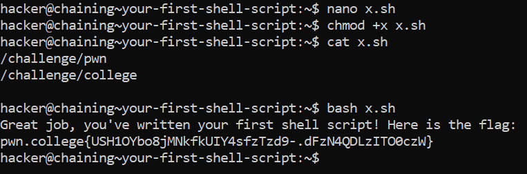

# Your First Shell Script

## Basic Understanding

We can put multiple commands in a file, called a `shell script`, and run them by executing the `shell script`.

All shell scripts end with the extension  `.sh`.

We can create a shell script by using the `touch` command or by creating them in a  text editor.

`bash(Bourne Again Shell)` -  When you run bash followed by a script file, it executes the commands listed in that file sequentially. 

## Challenge Objectives

The objectives of this challanege is to teach the user how to execute multiple commands on a shell script.

## Challenge Goals
In this challenge, we must run `/challenge/pwn` and then `/challenge/college`, but this time in a shell script called `x.sh`, then run it with bash.

So I created and opened my shell script in the `nano` text editor.

**Command** - `nano x.sh`

Then I ran the two commands on the nano  text editor and saved it.

After closing the text editor, I used the chmod command with `+x` permission to make the file executable.

**Command** - `chmod +x x.sh`

At last I used the `bash` command to execute the shell script.

**Command** - `bash  x.sh`

From this, we get the flag

## Flag

**pwn.college{USH1OYbo8jMNkfkUIY4sfzTzd9-.dFzN4QDLzITO0czW}**

## References

https://www.youtube.com/watch?v=boqC9QenshY&list=PLT98CRl2KxKGj-VKtApD8-zCqSaN2mD4w&index=2