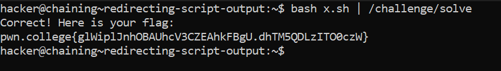

# Redirecting Script Output

## Basic Understanding 

All the redirecting techniques we have learnt in the earlier modules works on the shell scripts as well.

## Challenge Goals

In this level, we need to create a script that calls the `/challenge/pwn` command followed by the `/challenge/college` command, and pipe the output of the script into a single invocation of the `/challenge/solve` command.

Since we trying to pass the output of the shell to `/challenge/solve` program I have used the pipe  operator `|`.

**Command** - `bash x.sh |  /challenge/solve`

From this, we get the flag.

## Flag

**pwn.college{glWiplJnhOBAUhcV3CZEAhkFBgU.dhTM5QDLzITO0czW}**

