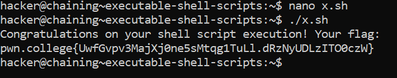

# Executable Shell Scripts

## Basic Understanding

We don't always need to use the `bash` command to execute a shell script.

We can instead simply invoke it via its relative or absolute path.

## Challenge Objectives

The objective of this challenge is to teach the user how to execute a shell script from its absolute or relative path.

## Challenge Goals

In this challenge, we have to make a shellscript that will invoke `/challenge/solve`, make it executable, and run it without explicitly invoking bash

I created the `x.sh`  script in the nano text editor with `/challenge/solve` as the content inside it.

Then I used used the following  commands to make it executable from it's relative path:

**Command** - `./x.sh`

From this, I got the flag

## Flag

**pwn.college{UwfGvpv3MajXj0ne5sMtqg1TuLl.dRzNyUDLzITO0czW}**

