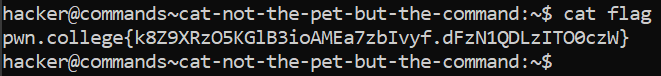

# cat: not the pet, but the command !

## Basic Terminologies

**cat command** - Used for reading files.Will also concatenate multiple files if given multiple arguments

## Challenge Objective

To understand the working of the **"cat"** command.

## Challenge Goals

In this challenge,the flag is copied to the flag file in our home directory.

We need to use the  **"cat"** command to read the flag file.

**Command** - cat flag

After executing this command, we successfully obtain our required flag.

## Flag
**pwn.college{k8Z9XRzO5KGlB3ioAMEa7zbIvyf.dFzN1QDLzITO0czW}**

