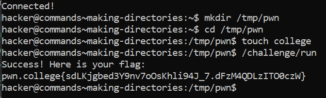

# Making Directories

## Basic Terminologies

**mkdir command**- Used to create a new directory.

## Challenge Objectives

The objective is of this challenge is to teach the user to make  directories using the mkdir  command.

## Challenge Goal

In this challenge,we must create a /tmp/pwn directory and make a college file in it.

I used the **"mkdir"** command to make a new directory **"/tmp/pwn"**.

**Command**-  mkdir /tmp/pwn

Then I used the **"touch"** command to make  a new file **"college"** in the **"/tmp/pwn"** directory.

**Command**-   touch college

Then I successfully ran the "/challenge/run" program and obtained the flag.

**Command**- /challenge/run

## Flag
**pwn.college{sdLKjgbed3Y9nv7oOsKhli94J_7.dFzM4QDLzITO0czW}**

