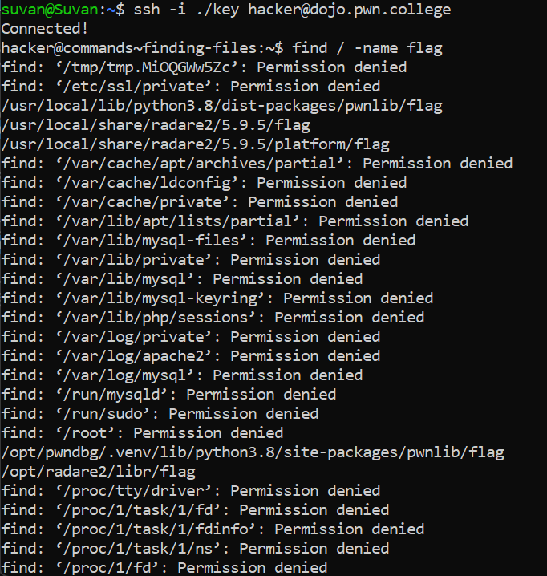
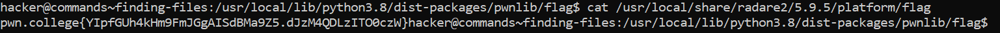

# Finding Files

## Baisc Understanding

The find command takes optional arguments describing the search criteria and the search location. If you don't specify a search criteria, find matches every file. If you don't specify a search location, find uses the current working directory (.).

We can also specify the criteria by giving the file name.

*Eg - find -name my_subfile*

We can also search for a file in the entire filesystem.

*Eg - find / -name my_subfile*

## Challenge Objective

The Objective of this challenge is to teach the user how to find files in Linux terminal.

## Challenge Goals

In this challenge, the flag is in a random directory on the filesystem. It's still called "flag" and we need to find it.

I used the **"find"** command followed by "/" to search through the entire filesystem with **"-name"** flag to search for the files named "flag".

**Command**- find / -name flag

This displayed all the directories and paths in the filesystem containing a "flag" file.

We must use the cat command on each of these paths till we find the flag.

I found the flag in the directory called  "/usr/local/share/radare2/5.9.5/platform/"

**Command**- cat /usr/local/share/radare2/5.9.5/platform/flag

## Flag

**pwn.college{YIpfGUh4kHm9FmJGgAISdBMa9Z5.dJzM4QDLzITO0czW}**