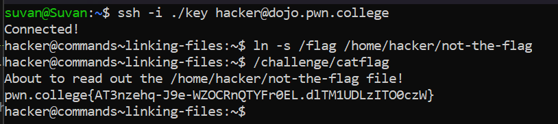

# Linking Files

## Basic Understanding

A link in UNIX is a pointer to a file. Creating links is a kind of shortcuts to access a file. Links allow more than one file name to refer to the same file, elsewhere. 

Links are file system objects that provide a way to establish connections between files or directories.

There are 2 types  of links in UNIX:
1. **Hard Link** - Can only link to files (and not directories).Cannot reference a file on a different disk or volume, and they reference the same inode as the original source.

*Abstract Understanding*- When you address your appartment using multiple addresses that all lead directly to the same place 

2. **Soft Link** - Can link to directories. Reference a file/folder on a different disk or volume.

*Abstract Understanding*- When you move appartments and have the postal service automatically forward your mail from your old place to your new place.

## Challenge Objectives

In this challenge, we will learn about symbolic links (also also known as symlinks).

**Symbolic Links** - ln -s

## Challenge Goals

In this level the flag is, as always, in "/flag", but "/challenge/catflag" will instead read out "/home/hacker/not-the-flag". Use the symlink, and fool it into giving you the flag!

## Flag

**pwn.college{AT3nzehq-J9e-WZOCRnQTYFr0EL.dlTM1UDLzITO0czW}**

