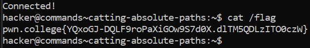

# Catting Absolute Paths

## Challenge Objectives

The objective of this challenge is to specify cat's argument as an absolute path

## Challenge Goals

In this directory, the flag is not copied to the home directory, but it is readable with its absolute path: **/flag**.

So I just simply use the "cat" command on "/flag"

**Command** - cat /flag

From this I obtain the flag.

## Flag
**pwn.college{YQxoGJ-DQLF9roPaXiGOw9S7d0X.dlTM5QDLzITO0czW}**

