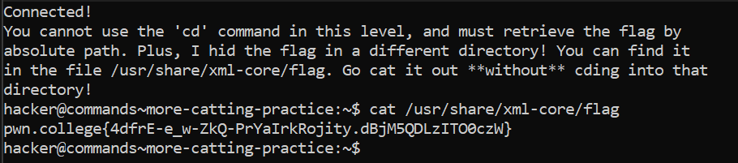

# More Catting Practice

## Challenge Goals

Here we must retrieve the flag from an absolute path only and we cannot use the cd command.

After logging into the server, I see a message that says that the flag is located in  **/usr/share/xml-core/flag** file.

So I used the cat command with the absolute path.

**Command**-  cat /usr/share/xml-core/flag

From this I obtain the flag.

## Flag
**pwn.college{4dfrE-e_w-ZkQ-PrYaIrkRojity.dBjM5QDLzITO0czW}**
