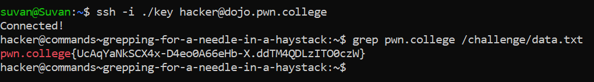

# Grepping for a needle in a haystack

## Basic Terminologies

**"grep command"**-  The command used to search for a pattern in a file or a set of files.

## Challenge Objective
The objective of this challenge is to find a certain string in a large file using the **"grep"** command.

## Challenge Goal

In this level, a hundred thousand lines of text are present in the **"/challenge/data.txt"** file. We need to use the "grep" command for the flag!

We know that in pwn.college, every flag starts with the initials **"pwn.college"**. Hence, I used the "grep" command to find the line that contains this string.

**Command**- grep pwn.college /challenge/data.txt

From this I was able to obtain the flag.

## Flag

**pwn.college{UcAqYaNkSCX4x-D4eo0A66eHb-X.ddTM4QDLzITO0czW}**

