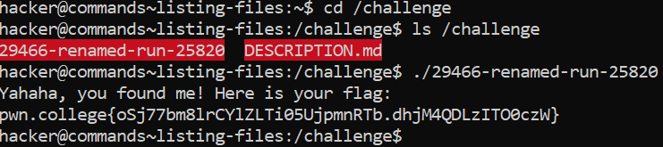

# Listing Files

## Basic Terminologies

**ls command** - Used to list all the files in the directory

## Challenge Objectives

The objective of this  challenge is to use the ls command to list all the files in the directory.

## Challenge Goals

In this challenge, "/challenge/run" is renamed with some random name.

We need to use the ls command in the "/challenge" directory to find the renamed file.

I first used the cd command to reach the /challenge directory.

**Command**- cd /challenge

Then I used the **"ls"** command to list  all the files in the directory. 

**Command**- ls /challenge

From this I found that exists a file named **"29466-renamed-run-25820"**  which is the renamed file.

I then opened the renamed file using the **"./"** to execute the file in the current directory("/challenge").

**Command**- ./29466-renamed-run-25820

From this I got the flag.

## Flag

**pwn.college{oSj77bm8lrCYlZLTi05UjpmnRTb.dhjM4QDLzITO0czW}**

