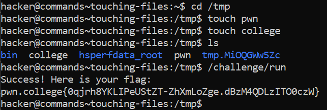

# Touching Files

## Basic Terminlogies

**touch command**- used to create new files and modify the timestamps of existing files.

## Challenge Objective

The objective of this challenge is to create a new file using the **"touch"** command and executing the file

## Challenge Goals

In this challenge, we must create two files: **"/tmp/pwn"** and **"/tmp/college"**, and run "/challenge/run" to get the flag!

I first opened a temporary directory using the following command.

**Command**- cd /tmp

Then , I created 2 new files using the **touch** command.

**Command**- touch pwn
**Command**- touch college

I used the ls command to check if both these files were saved in the  "/tmp directory".

**Command**- ls 

After confirming that the 2 files were present in the /tmp directory, I ran the "/challenge/run" program.

**Command**- /challenge/run

From this, I obtained the flag.

## Flag

**pwn.college{0qjrh8YKLIPeUStZT-ZhXmLoZge.dBzM4QDLzITO0czW}**

