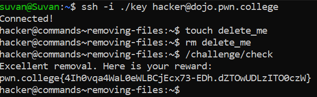

# Removing Files

## Basic Terminologies

**rm command**- Used to remove files

## Challenge Objective

The objective of this challenge is to teach  the user how to remove files using the rm command.

## Challenge Goals

In this challenge we'll need to  create a "delete_me" file in your home directory! 

Then we must delete it, then run /challenge/check, which will make sure we've deleted it and then give us the flag.

First, I created a new file called "delete_me" using the **"touch"** command.

**Command**-  touch delete_me

Then I used the **"rm"** command to delete this file.

**Command**-  rm delete_me

Then I ran the "/challenge/check"  command to verify that the file was deleted.

**Command** -  /challenge/check

This executed perfectly and I got the flag.

## Flag

**pwn.college{4Ih0vqa4WaL0eWLBCjEcx73-EDh.dZTOwUDLzITO0czW}**

