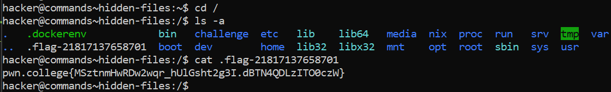

# Hidden Files

## Basic Understanding

 ls doesn't list all the files by default. Linux has a convention where files that start with a "." don't show up by default in ls and in a few other contexts. 
 
 To view them with ls, you need to invoke ls with the -a flag.

 ## Challenge Objective

 The objective of this challenge is to read hidden files by using the "ls" command with "-a" flag.

 ## Challenge Goals

 In this challenge, we need to find the flag, hidden as a dot-prepended file in / directory.

I first used the cd command to reach the "/" directory.

**Command**- cd /

Then I used the "ls" command with "-a" flag to see all the files starting with ".".

**Command**- ls -a

From this I found a file called **".flag-21817137658701"**.

I used the "cat" command to read all the contents of the file.

**Command**-  cat .flag-21817137658701

From this, I got the required flag.

## Flag

**pwn.college{MSztnmHwRDw2wqr_hUlGsht2g3I.dBTN4QDLzITO0czW}**

