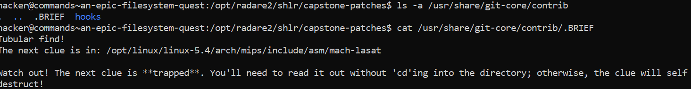

# An Epic Filesystem Quest

## Challenge Objectives

The Objective of this challenge is to navigate across different directories and files  to find the flag.

## Challenge Goal

In this challenge, the flag has been hidden.We have to initially follow these steps.

0. Your first clue is in /. Head on over there.
1. Look around with ls. There'll be a file named HINT or CLUE or something along those lines!
2. cat that file to read the clue!
3. Depending on what the clue says, head on over to the next directory (or don't!).
4. Follow the clues to the flag!

I followed the steps given above in the screenshot below.

We now have to  navigate to the next directory and find the flag. However we cannot use "cd" as that will self-destruct the clue.

Hence I used the ls command and found that there was file named "TEASER-TRAPPED".

I used the "cat" command to read the contents of the "TEASER-TRAPPED" file.

It informed me that the next clue is in another directory and it can only be readable by using the "cd" command.

I used the ls command and found a file called "INSIGHT". I used the "cat" command to read the contents of the INSIGHT file.

It told me that the next clue is in another directory which will be readable by only using the "cd" command.

I again used the ls command and found a file name "SNIPPET". I used the cat command on the "SNIPPET" file to read its contents.

The next clue was in  another directory for I used the "cd" command.

I again used the ls command and found a file name "HINT". I used the cat command on the "HINT" file to read its contents.

The next clue was in  another directory. This time instead of using the "cd" command I used another approach i.e. I directly used the ls command on the directory's path.

There was a file named "HINT" which I read using the  "cat" command.

I again lead me another directory but in this directory the filename started with "." and hence we needed to use the "ls" with -a flag.

I found a file named ".BRIEF". i used the "cat" command to read the file.

The next clue was in another directory and I cannot use the "cd" command as it will self-destruct.

Now there was a file called "SECRET-TRAPPED".  I used the "cat" command to read the file.

The next clue was again in another directory and I could only use the ls -a command

I found a file called ".NOTE". I used the cat command again and I FINALLY FOUND THE FLAG.

## Flag

**pwn.college{0BW0RIui0N7Z78o8PsmFY6CCxyR.dljM4QDLzITO0czW}**

