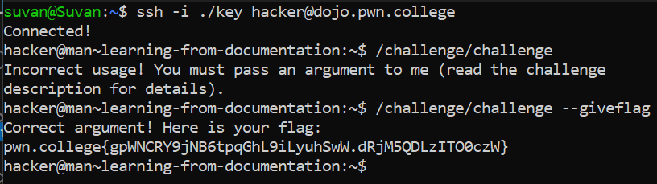

# Learning From Documentation

## Challenge Goal

**Here is this level's documentation for /challenge/challenge:**

Welcome to the documentation for **"/challenge/challenge!** To properly run this program, you will need to pass it the argument of **"--giveflag"**.

Well this challenge is pretty straightforward.

**Command**- /challenge/challenge --giveflag

## Flag

**pwn.college{gpWNCRY9jNB6tpqGhL9iLyuhSwW.dRjM5QDLzITO0czW}**