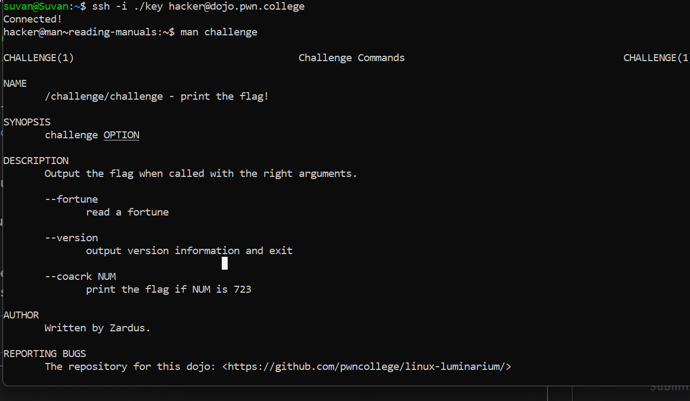

# Reading Manuals

## Challenge Objectives

This level introduces the **"man command"**. man is short for manual, and will display (if available) the manual of the command you pass as an argument.

You can scroll around the manpage with your arrow keys and PgUp/PgDn. When you're done reading the manpage, you can hit **"q"** to quit.

## Challenge Goals

The challenge in this level has a secret option that, when we use it, will cause the challenge to print the flag. We must learn this option through the man page for challenge!

I used the **"man"** command to open the manual for the "challenge" command.

**Command**- man challenge

I see that when we use the "/challenge/challenge" command followed by the argument **--coacrk** with the number argument **723** ,the flag will be printed.

**Command**-  /challenge/challenge --coacrk 723

From this we get the flag.

## Flag

**pwn.college{co7KSacrDPkaebVWmt2iqc3_tg9.dRTM4QDLzITO0czW}**

