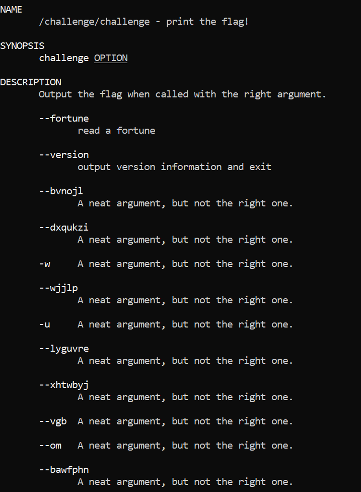
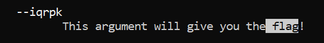
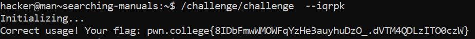

# Searching Manuals

## Challenge Objectives

The  objective of this challenge is to search for a specific manual in a library.

We can scroll man pages with the arrow keys (and PgUp/PgDn) and search with /. After searching, you can hit n to go to the next result and N to go to the previous result. Instead of /, you can use ? to search backwards!

## Challenge Goal

In this level, we need to find the option that will give us the flag by reading the challenge man page.

I used man challenge to open the manual.

**Command**- man challenge

From this, I could see the manual page.

I used the **"n"** keyword to go to the next result.

Then I used the "/" keyword with the argument as "flag" to search all the arguments that contain the  word "flag".

From there, I found the argument that contains  the flag.

By using the "/challenge/challenge" command with the argument **"--iqrpk"** contains the flag.

**Command** - /challenge/challenge --iqrpk

## Flag

**pwn.college{8IDbFmwWMOWFqYzHe3auyhuDzO_.dVTM4QDLzITO0czW}**

