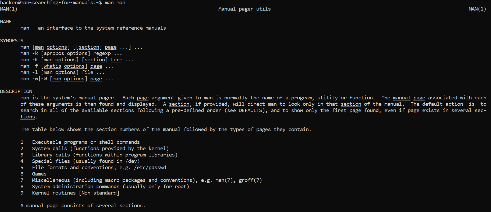
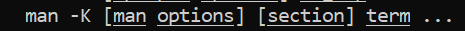
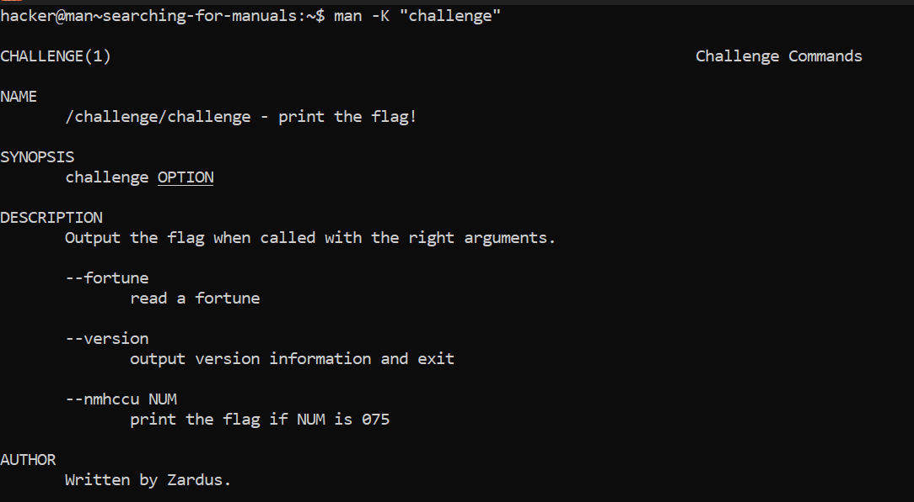

# Searching For Manuals

## Challenge Objectives

All of the man pages in a Linux system are gathered in a searchable database.

We can read the **"man"** page manpage by  typing **"man man"** in the terminal.

## Challenge Goals

In this level, we've been given 2 hints:

1. man man teaches you advanced usage of the man command itself, and you must use this knowledge to figure out how to search for the hidden manpage that will tell you how to use "/challenge/challenge".

2. though the man page is randomly named, you still actually use /challenge/challenge to get the flag!

So I used the **man man** command to read the manpage of the man command.

**Command**- man man

I found a keyword **"-K"** in the synopsis of the manpage.

**man -K** - Conducts a full-text search of the specified keywords throughout all of the man page sections.

Then I used the following command to find the manpage having **"challenge"**.

**Command**-  man -K "challenge"

From that I found the following argument.

Finally , I used the following command to get the flag.

**Command** - /challenge/challenge --nmhccu 075

## Flag

**pwn.college{0WnmhccIGM_u7_k5Gf53iI69FtQ.dZTM4QDLzITO0czW}**

