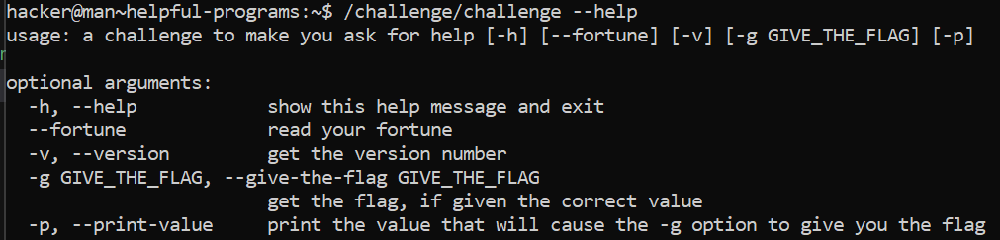

# Helpful Programs

## Challenge Objectives

Some programs don't have a man page, but might tell you how to run them if invoked with a special argument. Usually, this argument is --help, but it can often be -h or, in rare cases, -?, help, or other esoteric values like /?

## Challenge Goals

In this level, we will practice reading a program's documentation with **"--help"**.

I used the "/challenge/challenge" command with the **"--help"** argument.

**Command**- /challenge/challenge --help

Then I saw that there were two arguments **"g"** and **"p"**.

g- gives the flage if given the correct value as argument.

p- prints the value that will cause -g to give the flag.

Hence, I used the **"-p"** flag and got the value **"718"**.

**Command**- /challenge/challenge -p

Then I used the **"-g"** flag with the value  **"718"** and got the flag.

**Command**- /challenge/challenge -g 718

## Flag

**pwn.college{k7lOVZ1r8gKrX98TPNaMoeuc7IV.ddjM4QDLzITO0czW}**

