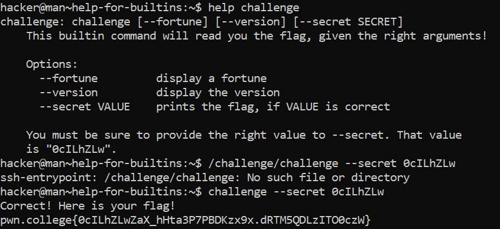

# Help For Builtins

## Basic Understanding

Some commands, rather than being programs with man pages and help options, are built into the shell itself. These are called builtins. Builtins are invoked just like commands, but the shell handles them internally instead of launching other programs. You can get a list of shell builtins by running the builtin help.

## Challenge Objectives

The  objective of this challenge is to understand the basic usage of builtins in the shell and how to use the "help" command for builtins.

## Challenge Goals

The goal of this challeneg is to use **"help"** to look up help for builtins. This challenge's challenge command is a shell builtin, rather than a program. Like before, we need to lookup its **"help"** to figure out the secret value to pass to it!

I used the **"help challenge"** command first.

**Command**- help challenge

We see that the argument **"--secret"** will print the flag only if we give the right value.

Also we can see that the right value is **"0cILhZLw"**.

I initially made the mistake of using the "/challenge/challenge" path instead of the "challenge" command.

Then I used the following command to get the flag.

**Command**-  challenge --secret 0cILhZLw

## Flag

**pwn.college{0cILhZLwZaX_hHta3P7PBDKzx9x.dRTM5QDLzITO0czW}**
