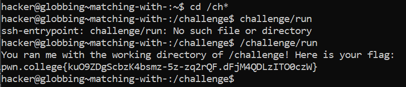

# Matching With "*"

## Challenge Objectives

The first glob we learn about is "*". When it encounters a * character in any argument, the shell treats it as **"wildcard"** and try to replace that argument with any files that match the pattern.

## Challenge Goals

Starting from your home directory,we need to change our directory to /challenge, but we must use globbing to keep the argument we pass to cd to at most four characters! Once there,we shall run "/challenge/run" for the flag!

I used the cd command  with the globbing pattern "/ch*" to change the directory to /challenge. 

**Command**- /challenge

Then I run the "/challenge/run" command in the directory.

**Command**- /challenge/run 

From this, we get the flag.

## Flag

**pwn.college{kuO9ZDgScbzK4bsmz-5z-zq2rQF.dFjM4QDLzITO0czW}**