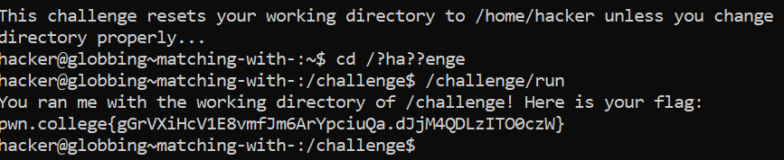

# Matching With "?"

## Challenge Objectives

Next, we learn about "?". When we encounters a "?" character in any argument, the shell treats it as single-character wildcard. This works like *, but only matches one character.

## Challenge Goals

Starting from the home directory,we need to  change directory to "/challenge", but use the "?" character instead of "c" and "l" in the argument to cd! Once we're there, run /challenge/run for the flag!

According to the instructions I used the following command.

**Command**- cd /?ha??enge

From this I was logged into the "/challenge" directory and I then used the "/challenge/run" command to get the flag

**Command**- /challenge/run

## Flag

**pwn.college{gGrVXiHcV1E8vmfJm6ArYpciuQa.dJjM4QDLzITO0czW}**
