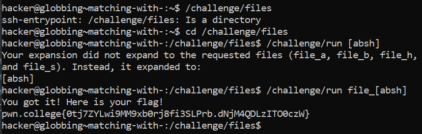

# Matching With []

## Challenge Objectives

The next glob we cover is "[]".  This is used to match any character within the brackets. The character can be a single character or a group of characters.

The square brackes are, essentially, a limited form of ?, in that instead of matching any character, [] is a wildcard for some subset of potential characters, specified within the brackets.

For example, [pwn] will match the character p, w, or n.

## Challenge Goals

A bunch of files are present in /challenge/files. We need change the working directory to "/challenge/files" and run "/challenge/run" with a single argument that bracket-globs into file_b, file_a, file_s, and file_h.

I first change my current working directory to "/challenge/files" using the "cd" command.

**Command**- cd /challenge/files

Then, I used the following command with [] globs to expand to the requested files: file_b, file_a, file_s, and file_h.

**Command**- /challenge/run file_[absh]
(During this writeup I realised I could have done [bash] smh )

From this, I got the flag.

## Flag

**pwn.college{0tj7ZYLwi9MM9xb0rj8fi3SLPrb.dNjM4QDLzITO0czW}**

