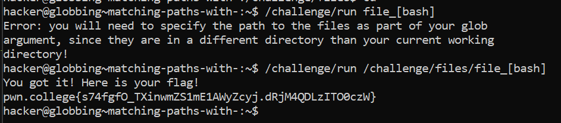

# Matching Paths With []

## Challenge Objectives

The objective of this challenge is to use bracket globbing to construct a command that expands to the absolute paths and runs the command.

## Challenge Goals

 In this challenge, a bunch of files are present in "/challenge/files". Starting from your home directory,we must run "/challenge/run" with a single argument that bracket-globs into the absolute paths to the file_b, file_a, file_s, and file_h files!

 

 So I initially made the mistake of directly running the command without specifying its path.

 Hence, in the next command , I used the absolute path to the command and then used the bracket globbing(**file_[bash]**) to get the desired flag.

 **Command**-  /challenge/run /challenge/files/file_[bash]

 ## Flag

 **pwn.college{s74fgfO_TXinwmZS1mE1AWyZcyj.dRjM4QDLzITO0czW}**