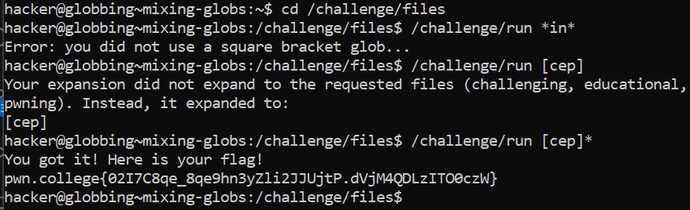

# Mixing Globs

## Challenge Objectives

The objective of this challenge is to teach the user how to use multiple types of globs to match a file in the directory and running a command through it.

## Challenge Goals

In this levels, there are many files in the "/challenge/files" directory. We must write a single, short (6 characters or less) glob that will match the files **"challenging", "educational", and "pwning"**.

I first changed my directory to the "/challenge/files" directory using the "cd" command.

**Command**- cd /challenge/files

Okay so here I noticed that the files "challenging", "educational", and "pwning" have **"in"** in common.

So I used the * glob in the following way to match all files having "in" in them.

**Command**- /challenge/run * in *

However, I got a prompt saying that I need to use the [] glob as well.

So then I noticed that the 3 files started with the letters "c","e" and "p". Hence I used the following command.

**Command**- /challenge/run [cep]

However, this did not work as it only matches with files having "c","e" and "p" exactly.

Therefore, I used the [cep] glob with the "*" glob to match all the files starting with letters "c","e" and "p" and having more character after these letters.

**Command**- /challenge/run [cep]*

From this, I got the required flag.

## Flag

**pwn.college{02I7C8qe_8qe9hn3yZli2JJUjtP.dVjM4QDLzITO0czW}**