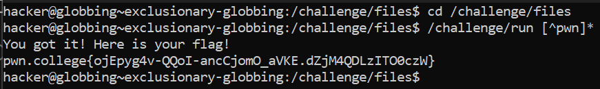

# Exclusionary Globbing

## Basic Understanding

Exclusionary Globbing is a technique used in Unix-like operating systems to exclude certain files.

[! or ^]- glob inverts, and that bracket instance matches characters that aren't listed.

## Challenge Goals

In this challenge, we must  go to "/challenge/files" and run "/challenge/run" with all files that don't start with **p, w, or n**.

I used the cd command to get to the "/challenge/files" directory.

Then I ran the "/challenge/run" command with the glob [^pwn]* to match all the files that do not start with "p", "w" or "n".

**Command**- /challenge/run [^pwn]*

From this, I successfully get the flag

## Flag

**pwn.college{ojEpyg4v-QQoI-ancCjomO_aVKE.dZjM4QDLzITO0czW}**
