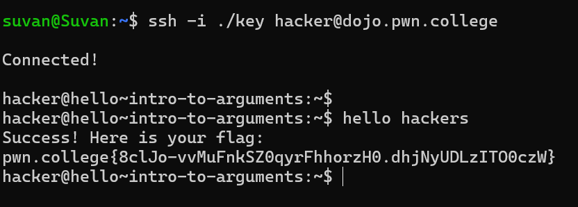

# Introduction To Arguments

## Challenge Goals

The goal of this challenge is to invoke a command with an argument to obtain the required flag.

**Arguments** are  used to pass information to a command or a function.

When you type a line of text and hit enter, the shell actually parses your input into a command and its arguments. The first word is the command, and the subsequent words are arguments.

After logging into the pwn.college server, I entered the command "hello" followed by the argument "hackers".

**Command**- hello hackers

After passing the command with the argument, I successfully obtained the flag.

# Flag

**pwn.college{8clJo-vvMuFnkSZ0qyrFhhorzH0.dhjNyUDLzITO0czW}**