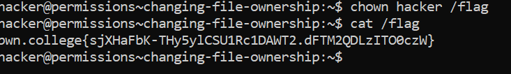

# Changing File Ownership

## Challenge Objectives

In Linux, files have different permissions or file modes. You can check out a permissions of a file or directory using **ls -l**.

`ls -l` - Used to check permissions of a file

Example -  `ls -l filename.txt`
            -r-------- 1 root root 53 Jul  4 04:47 /flag

The first character of each line represents the file type. `-` represents  a regular file, `d` represents a directory, `l` represents a symbolic link, `

The next nine characters are the actual access permissions of the file or directory, split into 3 parts.

`First 3 characters` -  Permissions for the user who owns the file(aka **"owner""**).

`Next 3 characters` -  Permissions for the group that the file belongs to (aka **"group""**).

`Last 3 characters` - Permissions for other users and other groups.

The two most important user accounts are:
1. Your user account! On pwn.college, this is the hacker user, regardless of what your username is.
2. **root**. This is the administrative account and, in most security situations, the ultimate prize. If you take over the root user, you've almost certainly achieved your hacking objective!

`chown [username] [file]` - Used to change the ownsership of a file

## Challnege Objectives

The objective of this challenge is to teach the user how to change the ownership of file  using the **chown** command.

## Challenge Goals

In this level, we need changing the owner of the `/flag` file to the `hacker` user, and then obtain the flag.

So I first used the `chown` command with the username as `hacker` i.e my username on pwn college and filename as `/flag` to transfer root permission to  my user account.

**Command** - `chown hacker /flag`

Then I used the cat command on /flag to get the flag.

## Flag

**pwn.college{sjXHaFbK-THy5ylCSU1Rc1DAWT2.dFTM2QDLzITO0czW}**

