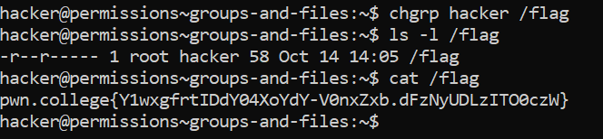

# Groups And Files

## Basic Understanding

Files have both an owning user and group. A group can have multiple users in it, and a user can be a member of multiple groups.

`id command` - Used to check which groups you are a part of.

Example - ls -l filename
         
          Output -> -r-------- 1 root root 53 Jul  4 04:47 /flag

- The first part (-rw-r--r--) represents the file permissions.

- The first root is the user owner of the file.

- The second root is the group owner of the file.

`chgrp [username] [filename] command` - Used to change the group ownership.

## Challenge Objectives

The objective of this challenge is to teach the user how to change the ownership of a group.

## Challenge Goals

In this level, Ithe flag is readable by whatever group owns it, but this group is currently root.We have to use `chgrp` to change the ownership of the flag file.

I used the chgrp  command to change the group ownership of the flag file to the group "hacker".

**Command** - `chgrp hacker /flag`

Then I used the ls -l command to check if the grp was changed correctly.

Finally I used the "cat" command to open the  flag file and read its contents.

## Flag

**pwn.college{Y1wxgfrtIDdY04XoYdY-V0nxZxb.dFzNyUDLzITO0czW}**

