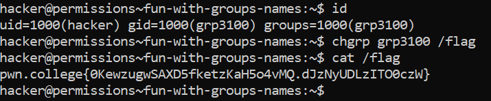

# Fun With Group Names

## Challenge Goals

In this challenge, we need to use `chgrp` to change the group permissions but this time the name of the group is randomized and we don't know its name.
We will use `id` to see all groups we are part of right now and  then use `chgrp` with the group name we found.

So I first used the `id` command to check all groups we are part of.

**Command** - `id`

From this, I see that there is a grp called **"grp3100"**.

Then I used to `chgrp` command to change the group ownership of the **/flag** file.

**Command** - `chgrp  grp3100 /flag`

Then I used the `cat` command to view the content of flag file.

## Flag

**pwn.college{0KewzugwSAXD5fketzKaH5o4vMQ.dJzNyUDLzITO0czW}**

