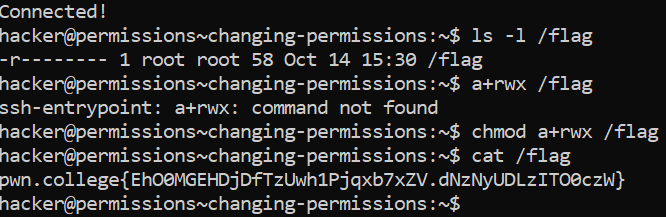

# Changing Permissions

File permission in a linux are as follows:

`r - Used to read  the file.`

`w - Can modify/write the files`

`x - Can execute the files`

Examples of some file permission commans -

- `u+r` : as above, adds read access to the user's permissions

- `g+wx` : adds write and execute access to the group's permissions
- `o-w` : removes write access for other users

- `a-rwx` : removes all permissions for the user, group, and world.

## Challenge Objectives

The objective of this challenge is to teach the user how to change permissions in Linux.

## Challenge Goals

In this challenge, we must change the permissions of the `/flag` file to read it.

I first used the `ls -l` command to list all the permissions for the `/flag` file.

**Command** - `ls -l /flag`

Then I saw that only the user has read permissions for the flag file.

Then I used the `chmod` command with `a+rwx` to add read,write and executable permissions to all groups and users.

We can verify this by again using the  `ls -l` command.

Then I used the `cat` command on the flag file to obtain its contents.

**Command** - `cat /flag`

From this, I got the flag.

## Flag

**pwn.college{EhO0MGEHDjDfTzUwh1Pjqxb7xZV.dNzNyUDLzITO0czW}**

