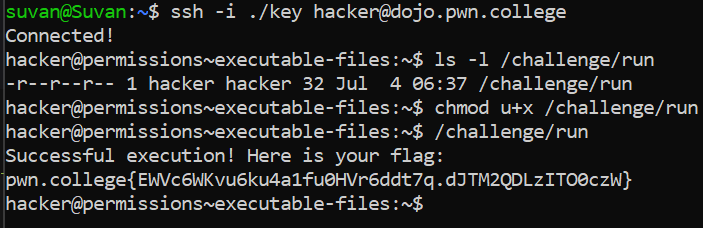

# Executable Files

## Challenge Objectives

The objective of this challenge is to teach the user how to change permissions and make them executable.

## Challenge Goals

In this challenge, the `/challenge/run` program will give you the flag, but we must first make it executable.

I used the `ls -l` command  to check the permissions of the `/challenge/run` file.

**Command** - `ls -l /challenge/run`

Then I see that hacker i.e us is the owner as well as the group.

All 3 i.e. the owner, group and others only have read permissions.

In order to make the owner have executable permission, I used the following command.

**Command** - `chmod u+x /challenge/run`

u - stands for user or the owner

x - gives executable permission

Then I ran the  `/challenge/run` program to get the flag.

## Flag

**pwn.college{EWVc6WKvu6ku4a1fu0HVr6ddt7q.dJTM2QDLzITO0czW}**
