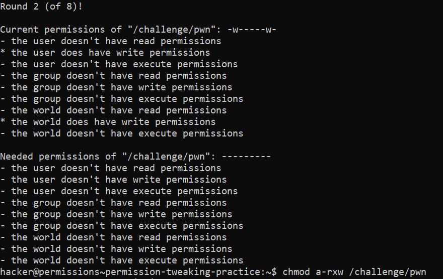
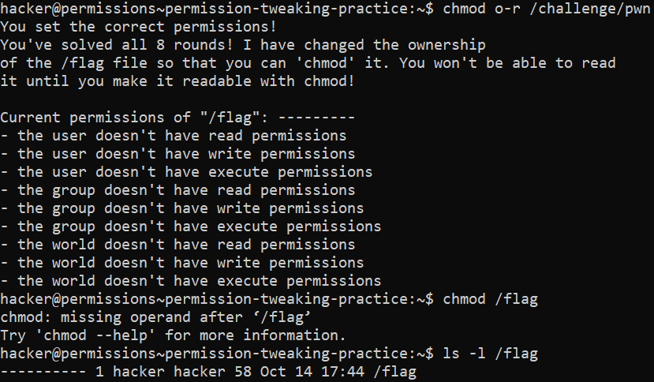

# Permission Tweaking Practise

## Challenge Objectives

The objective of this challenge is to practise  permission tweaking in Linux and making the user more efficient in using permissions effectively.

## Challenge goals

This challenge will ask you to change the permissions of the `/challenge/pwn`.  If we get the permissions right eight times in a row, the challenge will let you `chmod /flag` to make it readable for yourself.

Okay so this was a very lenghty challenge so I'll just paste the screenshots as they are pretty self explanatory.

**Round  1:**

**Round 2:**

**Round 3:**

**Round 4:**

**Round 5:**

**Round 6:**

**Round 7:**

**Round 8:**

**Final Execution**

