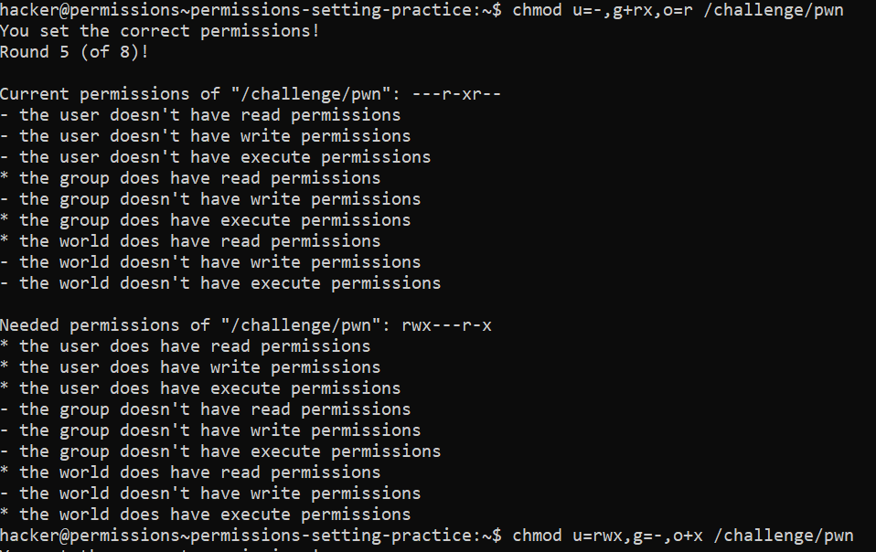
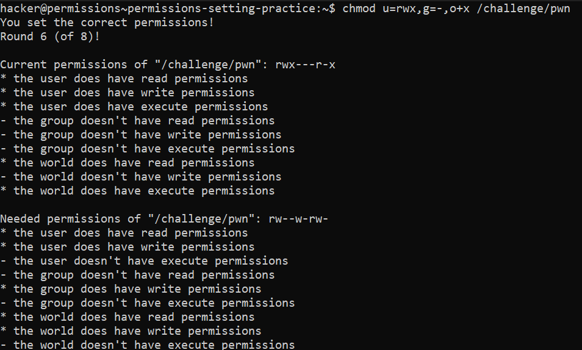

# Permission Setting Practise

## Basic Understanding

`chmod` can also simply set permissions. This is done by using `=`.

Examples -

- **u=rw** sets read and write permissions for the user, and wipes the execute permission.
- **o=x** sets only executable permissions for the world, wiping read and write.
- **a=rwx** sets read, write, and executable permissions for the user, group, and others.

## Challenge Goals

In this challenge also we need to change permissions 8 times so I have attached the screenshot of each round below.

**Round 1:**

**Round 2:**

**Round 3:**

**Round 4:**

**Round 5:**

**Round 6:**

**Round 7:**

**Round 8:**

**Final Execution:**

## Flag

**pwn.college{YA68lcKQXfEdnEBF8t5gs1CHvkz.dNTM5QDLzITO0czW}**

