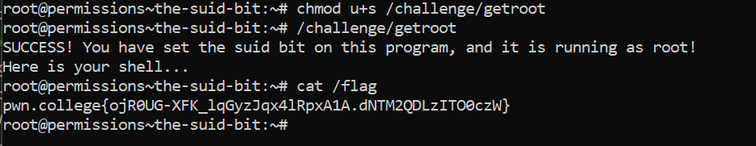

# The SUID Bit

## Challenge Objectives

There are many cases in which non-root users need elevated access to do certain system tasks.

The `"Set User ID" (SUID)` permissions bit allows the user to run a program as the owner of that program's file.

The `s` part in place of the **executable bit** means that the program is executable with SUID. It means that, regardless of what user runs the program (as long as they have executable permissions), the program will execute as the owner user (in this case, the root user).

## Challenge Goals

In this challenge, we need to add the SUID bit to the `/challenge/getroot` program in order to spawn a root shell and then use the `cat` command to get the flag.

So I first used chmod command with u+s suffix to set the SUID bit to the /challenge/getroot program.

**Command** - `chmod u+s /challenge/getroot`

Then I ran the `/challenge/getroot`  program to spawn a root shell.

From the I used the cat command to get the flag.

## Flag

**pwn.college{ojR0UG-XFK_lqGyzJqx4lRpxA1A.dNTM2QDLzITO0czW}**
