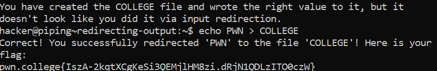

# Redirecting Outputs

## Challenge Objectives

We can redirect output **"stdout"** in Linux using  the `>` symbol.

 For example, `echo "Hello World" > output` will redirect output  to a file named `output`

 When we use the cat command , we get the result - **Hello World**.

 ## Challenge Goals

 In this challenge, we must use this input redirection to write the word PWN (all uppercase) to the filename COLLEGE (all uppercase).

 

 I had to  use the following command to solve this challenge:

 **Command**- echo PWN > COLLEGE

 This basically redirects the output string "PWN" to the file "COLLEGE".

 From this, I got the flag.

 ## Flag

 `pwn.college{IszA-2kqtXCgKeSi3QEMjlHM8zi.dRjN1QDLzITO0czW}`

