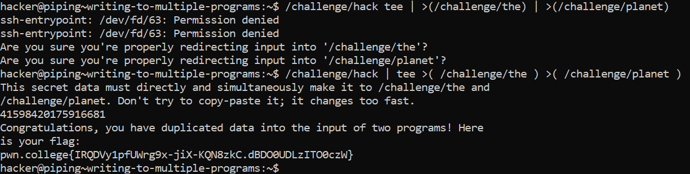

# Writing To Multiple Programs

## Basic Understanding

Linux follows the philosophy that **"everything is a file"**. The system strives to provide file-like access to most resources, including the input and output of running programs.

## Challenge Goals

In this challenge, we have `/challenge/hack`, /`challenge/the`, and `/challenge/planet`.We have to run the /challenge/hack command, and duplicate its output as input to both the /challenge/the and the /challenge/planet commands.

The mistake I made initially was that I used the "tee" command before the pipe "|".

**Command**- /challenge/hack | tee >( /challenge/the ) >( /challenge/planet )

From this we get the flag

## Flag

`pwn.college{IRQDVy1pfUWrg9x-jiX-KQN8zkC.dBDO0UDLzITO0czW}`

