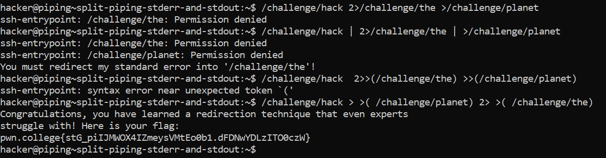

# Split-piping stderr and stdout

## Challenge Goals

In this challenge, wewill need to combine your knowledge of `>(), 2>, and |`.

We have the following info:

- **/challenge/hack**: this produces data on stdout and stderr
- **/challenge/the**: you must redirect hack's stderr to this program
- **/challenge/planet**: you must redirect hack's stdout to this program

In the 1st prompt I 

In the 2nd prompt, I made the mistake of using the pipe command unnecessarily.`"|" is used to pipe stdout to another command`, but in this case, you want to use process substitution to handle both stdout and stderr separately.

In the 3rd prompt my approach was correct but the syntax was wrong.

**Command**- /challenge/hack > >( /challenge/planet) 2> >( /challenge/the)

From this command I got the required flag.

## Flag

`pwn.college{stG_piIJMWOX4IZmeysVMtEo0b1.dFDNwYDLzITO0czW}`
