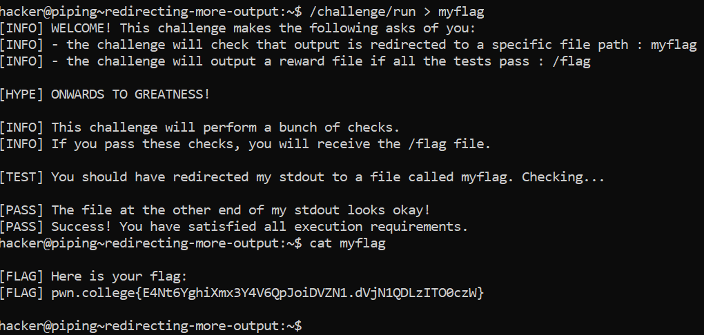

# Redirecting More Outputs

## Challenge Goals

In this level, `/challenge/run` will once more give us a flag, but only if we redirect its output to the file myflag. Your flag will, of course, end up in the `myflag file`!

I ran the command **"/challenge/run"** and redirected it's output to the file **"myflag"** file.

**Command**-  /challenge/run > myflag

The terminal then performed some checks and it was successful.

Then I used the **"cat"** command to get the output flag.
**Command**- cat myflag

## Flag

`pwn.college{E4Nt6YghiXmx3Y4V6QpJoiDVZN1.dVjN1QDLzITO0czW}`
