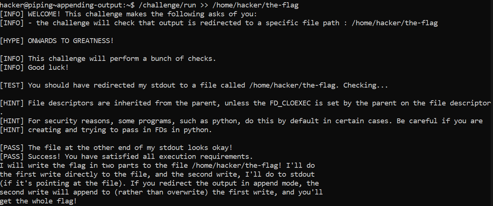

# Appending Output

## Basic Understanding

A common use-case of output redirection is to save off some command results for later analysis.

If we want to run a bunch of commands, save their output, and grep through it later, we'd want to keep appending the outputs to the same file.

For this purpose, we use the `>>`  operator, which appends to the file instead of overwriting it.

## Challenge Objectives

The objective of this challenge is to teach the user how to append outputs of one file to another.

## Challenge Goals

In this challenge,we must run `/challenge/run` with an append-mode redirect of the output to the file `/home/hacker/the-flag`.The practice will write the first half of the flag to the file, and the second half to stdout if stdout is redirected to the file.

So I append the output  of **/challenge/run** to **/home/hacker/the-flag** using `>>` operator.

**Command**-  /challenge/run >> /home/hacker/the-flag

This basically appends the first half of the flag to the file **"the-flag"**.

I repeated the same command to append the 2nd  half of the flag to the file **"the-flag"**.

**Command**- /challenge/run >> /home/hacker/the-flag

Then I used the **"cat"** command and obtained the flag.

**Command**-  cat the-flag

## Flag

`pwn.college{wyN72kMO18VhDwcYpK0ugNF9b2X.ddDM5QDLzITO0czW}`

