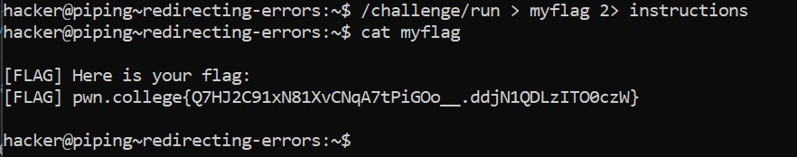

# Redirecting Errors

## Basic Understanding

A File Descriptor (FD) is a number the describes a communication channel in Linux. We've already been using them.For example - 

1. FD 0: Standard Input
2. FD 1: Standard Output
3. FD 2: Standard Error

When you redirect process communication, you do it by FD number, though some FD numbers are implicit... For example, `a >` without a number implies `1>`, which redirects FD 1 (Standard Output).

`some_command > output.log 2> errors.log`

This command will redirect output to output.log and errors to errors.log.

## Challenge Objectives

The objective of this challenge is to learn abt  FDs and redirections using FDs.

## Challenge Goals

In this challenge, we will need to redirect the output of `/challenge/run`, like before, to `myflag`, and the "errors" (in our case, the instructions) to `instructions`.

So in this challenge, I used **>** to redirect the output of "/challenge/run" to **myflag** file and **2>**  to redirect the errors to **instructions** file.

**Command**-  /challenge/run > myflag 2> instructions

Then I used the "cat" command on myflag to get the flag.

**Command**-  cat myflag

## Flag

`pwn.college{Q7HJ2C91xN81XvCNqA7tPiGOo__.ddjN1QDLzITO0czW}`

