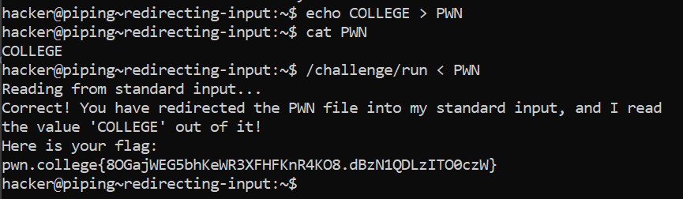

# Redirecting Input

## Basic Understanding
Just like we can redirect the output of a program, we can also redirect inputs to programs by using the  `<` symbol. 

## Challenge Objectives

The objective of this challenge is to familiarise  ourselves with the concept of redirecting input to a program.

## Challenge Goals

In this level, we will practice using `/challenge/run`, which will require you to redirect the `PWN` file to it and have the PWN file contain the value `COLLEGE`. To write that value to the PWN file, recall the prior challenge on output redirection from echo!

So I used the echo command to basically  write the value `COLLEGE` to the PWN file by using the `>` operator.

**Command**- echo COLLEGE > PWN

Then I used the cat command on the PWN file to see if it was properly copied

**Command**- cat PWN

Then I ran the **"/challenge/run"** command and used the `<` operator to input the contents of  file **"PWN"** into it.

**Command**-  /challenge/run < PWN

From this, I successfully obtained my flag

## Flag

`pwn.college{8OGajWEG5bhKeWR3XFHFKnR4KO8.dBzN1QDLzITO0czW}`

