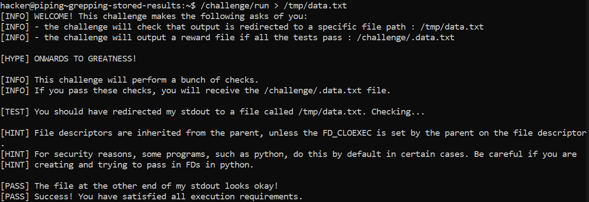
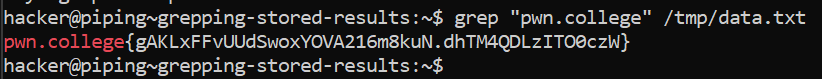

# Grepping Stored Results

## Challenge Objective

Teh objective of this challenge is to redirect the output of one file to another and then using the "grep" command to find the flag.

## Challenge Goals

In this challenge, we have follow the given steps:
1. Redirect the output of `/challenge/run` to `/tmp/data.txt`.
2. This will result in a hundred thousand lines of text, with one of them being the flag, in `/tmp/data.txt`.
3. Grep that for the flag!

Okay so I first redirected the output of the **"/challenge/run"** command  to **"/tmp/data.txt"** using the following command:

**Command**- /challenge/run >  /tmp/data.txt

We know that all the flags start with the string **"pwn.college"**.

So I used the **"grep"** command to find this specific string in the  "/tmp/data.txt file".

**Command**- grep "pwn.college" /tmp/data.txt

From this, I successfully obtain the flag.

## Flag

`pwn.college{gAKLxFFvUUdSwoxYOVA216m8kuN.dhTM4QDLzITO0czW}`

