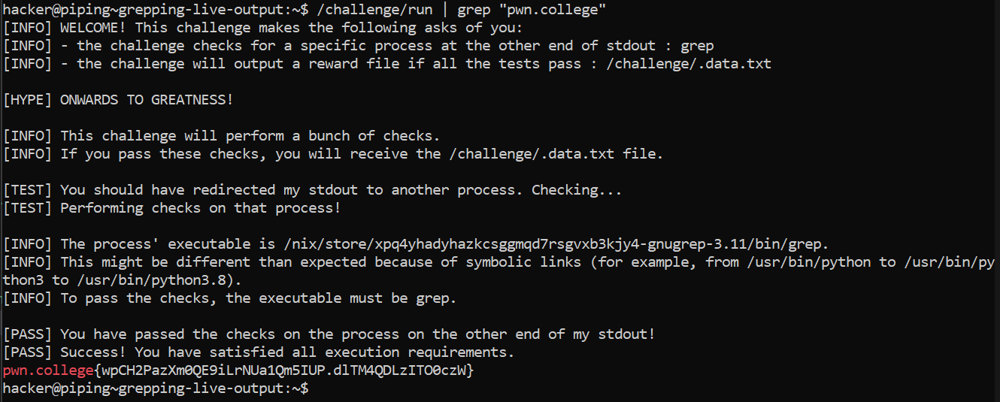

# Grepping Live Outputs

## Basic Terminologies

**| (pipe operator)**-  Used to redirect the output of a command to another command.

Standard output from the command to the left of the pipe will be connected to (piped into) the standard input of the command to the right of the pipe

## Challenge Objective

The objective of this challenge is to teach how to use the pipe command in Linux

## Challenge Goals

`/challenge/run` will output a hundred thousand lines of text, including the flag. We will need to use the **"grep"** command for the flag.

I used the pipe operator "|"  to redirect the output of the command **"/challenge/run"** and connect it to the input  of the command **"grep"** to search for the string "pwn.college" like we did in the previous level.

**Command**-  /challenge/run | grep "pwn.college"

From this, we get the flag.

## Flag

`pwn.college{wpCH2PazXm0QE9iLrNUa1Qm5IUP.dlTM4QDLzITO0czW}`
