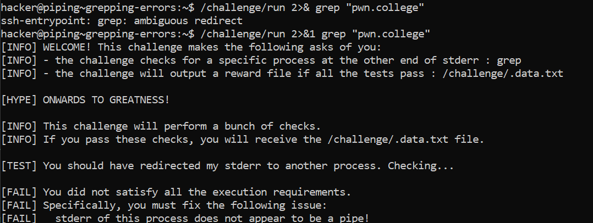
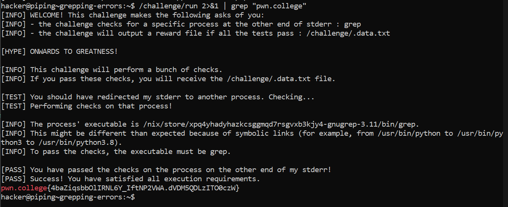

# Grepping Errors

## Basic Understanding

**&> operator**-  redirects a file descriptor to another file descriptor. This means that we can have a two-step process to grep through errors: first, we redirect standard error to standard output (2>& 1) and then pipe the now-combined stderr and stdout as normal (|)!

## Challenge Objective

The objective of this challenge is to familiarise the user with the  &> operator and its usage in grepping through errors.

Grepping through errors means using the grep command to search through the standard error output of a program.

## Challenge Goals

 I initially got an error because I hadn't used the pipe **"|"** operator before grepping the file.

 So the correct command is as follows:

**Command**-  /challenge/run 2>&1 | grep "pwn.college"

From this I get the flag.

## Flag

`pwn.college{4baZiqsbbOlIRNL6Y_IftNP2VWA.dVDM5QDLzITO0czW}`

