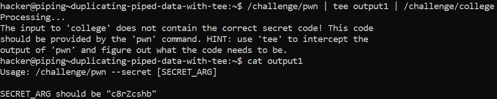
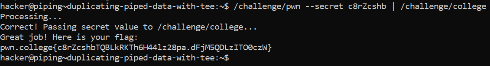

# Duplicating Piped Data With Tee

## Basic Terminologies

**tee command**-  Tee command is used to duplicate the output of a command to multiple files.

## Challenge Objectives

The objective of this challenge is to teach users to duplicate the output of a command to multiple files by using the **tee** command.

## Challenge Goals

In this challenge, `/challenge/pwn` must be piped into `/challenge/college`, but you'll need to intercept the data to see what pwn needs from you!

I used the **"tee"** command to duplicate the output of /challenge/pwn to /challenge/college and another file which I named "output1".

The question says that we'll need to intercept the data to see what pwn needs from us and the "output1" file does that.

**Command**-  /challenge/pwn | tee output1 | /challenge/college 

Then I used the cat command on "output1" to get the secret argument.

**Command**- cat output1

The argument I needed to pass is --secret[c8rZcshb]

After this I was making some errors while entering the prompts. But after a few minutes I realised my mistake and used the correct command with the right arguments.

**Command**- /challenge/pwn --secret c8rZcshb | /challenge/college

From this, I got the flag

## Flag

`pwn.college{c8rZcshbTQBLkRKTh6H44lz28pa.dFjM5QDLzITO0czW}`