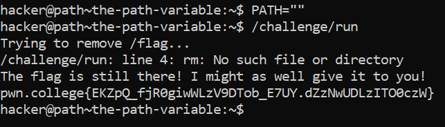

# The Path Variable

## Basic Understanding

`PATH variable` - stores a bunch of directory paths in which the shell will search for programs corresponding to commands

## Challenge Objective

The objective of this challenge is to teach the user about the path variable

## Challenge Goals

In this level, you will disrupt the operation of the `/challenge/run` program. This program will DELETE the flag file using the rm command. However, if it can't find the rm command, the flag will not be deleted, and the challenge will give it to you! Thus, you must make it so that /challenge/run also can't find the rm command!

So I first blanked out the PATH variable  to prevent the rm command from being found. 

**Command** - `PATH=""`

Then I ran the `/challenge/run` program and obtained the flag.

## Flag

**pwn.college{EKZpQ_fjR0giwWLzV9DTob_E7UY.dZzNwUDLzITO0czW}**